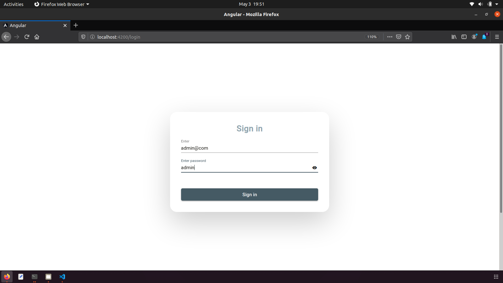
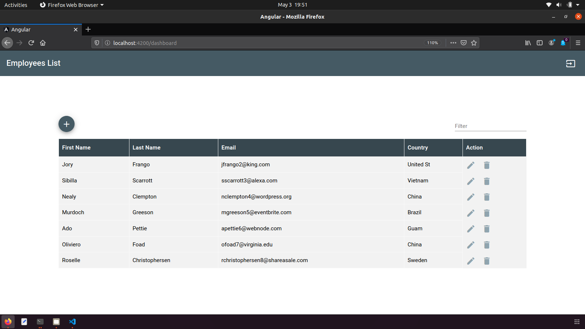

# Angular

This project was generated with [Angular CLI](https://github.com/angular/angular-cli) version 9.1.3 and UI with [Angular Material](https://material.angular.io/) version 9.2.1

## Development server

Run `npm run json:server` for a JSON API. 
Run `ng serve` for a dev server. Navigate to `http://localhost:4200/`. The app will automatically reload if you change any of the source files.

## Sign in 
email: admin@com  
password: admin

